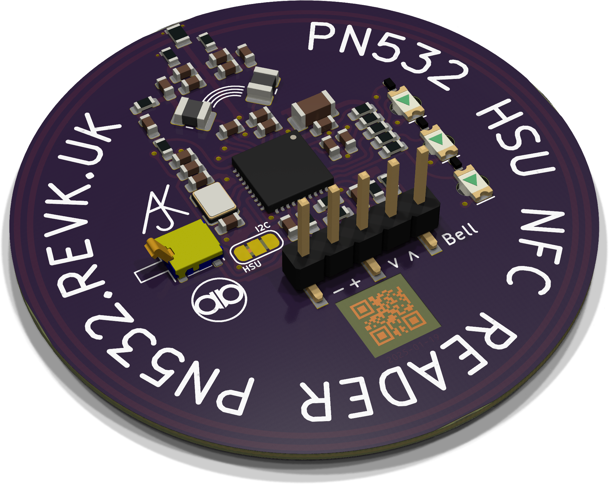

# Access control module

The door control module used with the Solar System alarm panel involves two parts - an outside unit (reader) and an inside unit (controller). You also need an electric lock of some sort (e.g. mag lock), a 12V supply (battery backed up ideally), and typically an exit button. A door closed sensor such as reed switch is usually required as well. If the lock cannot be opened from the inside you may also need some sort of *break glass* emergency exit box in line to the lock power.

The github project includes the software, PCB designs, and the 3D print designs.

## Outside unit (NFC card reader)

The external board is an NFC card reader with *red*, *amber* and *grren* status LEDs There is a 3D case design that provides a low profile reader on a wall/door - where ideally the connector wire is in a hold behind the reader. If not, then a 3D printable support is included (may be needed if used on a metal door). The reader also includes a tamber contact if the case is removed. It could also be fitted behind a sheet of glass, but test that it works with your fobs/cards in such case.

The actual contacts on the reader are 0.1" square pins, but typically they would be used with the same mini SPOX plug used in the rest of the system. There are actually 5 pins on the reader - the 5th being a doorbell contact input. If not needed then this 5th pin can be chopped off leaving juse the necessary 4 pins. These 4 pins are connected to the 4 pin header on the controller in the same order.

The reader is a separate GitHub project [PN532](https://github.com/revk/ESP32-PN532).

## Inside unit (Access2)

The inside unit controls the door access, and is typically small enough to fit in the back of an exit buttonor break glass box, or a shallow surface pattress box. A 3D printed case design is available as well - this is needed for the tamper contact to work.

The board also has a simple RGB LED which can be used to [indicate status](Tech-LED.md).

### Connectors

The board is designed to work (as per the image) with mini SPOX connectors. However, as these need a special cirmp tool the board may be supplied with 0.1" headers or alternative headers with push fit connectors. Please check when ordering.

|Connector|Meaning|
|---------|--------|
|2 pin|This is the power input, with `GND` and `12V`. The board can actually work from `6V` to `40V` but you would normally connected to a 12V DC battery box, which is typically arounf 13.5V output. This can the same power used for the lock, or a separate power feed if you prefer.|
|3 pin|The 3 pin connector is the relay output, with `GND`, `A`, and `B` contacts. The relay is a solid state relay between `A` and `B` so can work using a separate power supply. It is desigend to handle at least 1A. There is also a solder pad link on the back of the board that allows the DC supply to connect to `A` which means `B` will be switched to the supply.|
|4 pin|The 4 pin header goes to the outside NFC reader board, and is `GND`, `5V`, `Tx`, and `Rx`. It connects to the first 4 pins on the NFC reader in the same order.|
|6 pin|The 6 pin header are all GPIO pins, but are typically configured to be pairs of `GND` and `input` which go via an external contact such as an exit button, door closed contact, and lock disengaged contact. Their usage is configurable and can allow all 6 to be input pins if required.|

The board may have a USB-C connector as well, or may not, as this is used for programming and debug. If fitted it can be used to flash the board. If not, then there are 5 pads that can be used with the (Tasmotizer)[https://github.com/revk/Tasmotizer-PCB] board to flash.

*Shown with mini SPOX connectors.*

## Access3

An alternative board is also available which has an additional 3 pin connector for a second solid state relay. This is slightly bigger, obviously.

*Shown with PTSM connectors*
