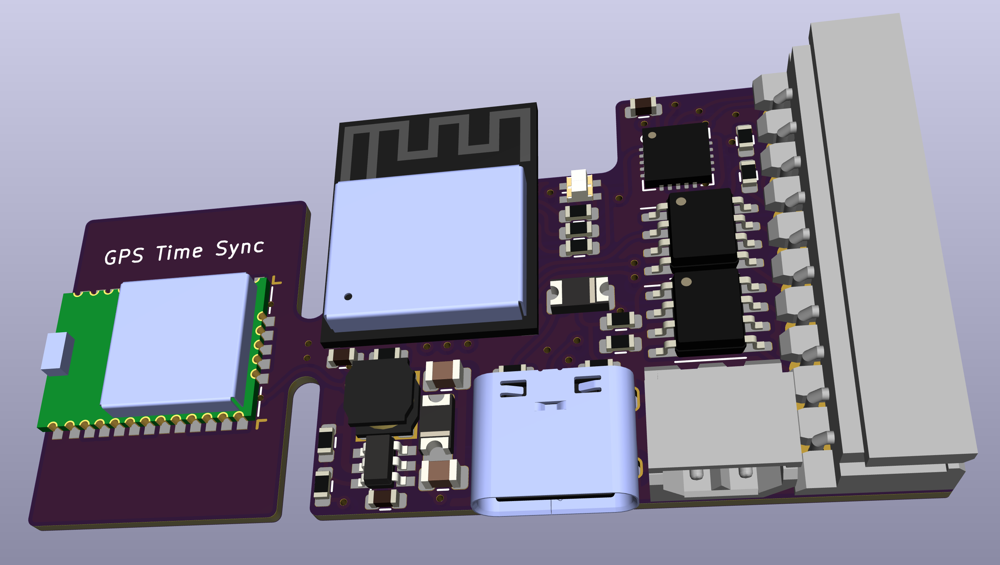

# Bell box controller

A design is included for a bell box control module - this is specifically tailored to suit installation in a Pyronix bell box with a 10 way connector directly mapping to the 10 screw terminals for power, bell, engineering hold off, strobe, backlight disable, tamper, and fault. Some models do not have fault or backlight. A separate 2 pin power connection is also provided allowing power to this unit and then on to the bell box via the 10 pin connector.

This can be used as a general purpose unit providing two simple contact inputs (normally tamper and fault) and four outputs that are driven to power supply or pulled to ground. The inputs include ESD protection diodes and resistors.

Power can be 4.5V to 18V but will normally be the 12V required for the bell box. A USB-C connector is provided for debug and programming (and can be connected at same time as power). An RGB status LED is also included on board.

The module also includes a GPS (Quectel L96) module - this can be cut/snapped off when not used as a GPS to make a smaller module. When included this provides time sync to the system so it can operate autonomously without WiFi/internet.

Again, a 3D case design is availble, but the board itself does not have a tamper contact - it connects to the Tamper in the bell box itself.

