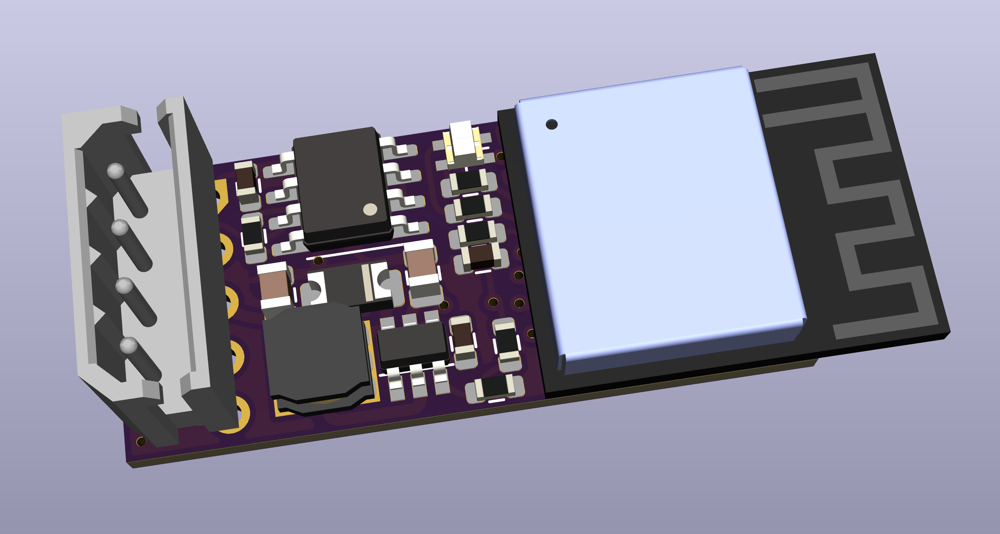

# Keypad controller

The keypad controller is a tiny PCB with a 4 pin connector.

It is designed to physically fit inside the case of a Honeywell Galaxy alarm panel keybad. There is space in the case at the bottom.

You need to solder wires to the back of the PCB for `GND`, `DC`, `A`, and `B`. These connect in the same order to the 4 pin header.

The keypad then needs normal power on its screw terminals, but does not have anything connected to its `A`/`B` contacts as the keypad controller talks to it directly.

The board also has a simple RGB LED which can be used to [indicate status](Tech-LED.md).

