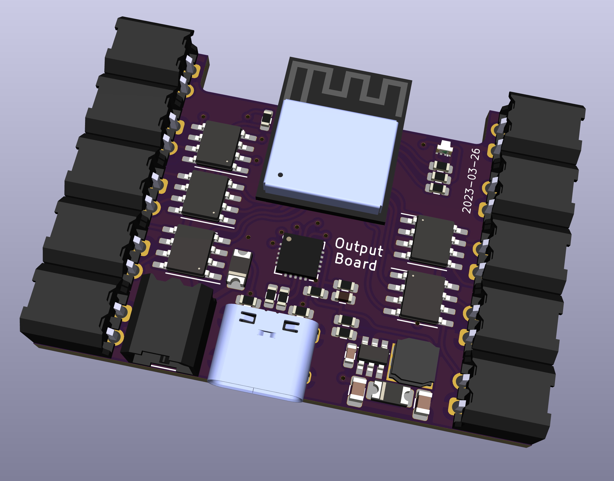

# Output board

The output module board provides 10 separate outputs, each on a 2 pin connector. The outputs are either connected to GND or to the DC input.

This provides a general purpose driver for external devices that work on DC.

