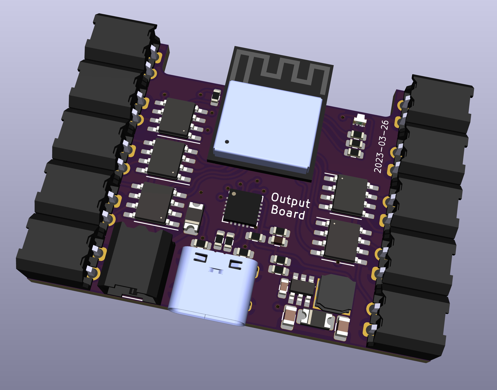

# Relay 10 output board

The output module board provdies 10 separate outputs, each on a 2 pin connector. The outpurs are either connected to GND or to the DC input.

This provides a generalk purpose driver for external devices that work on DC.

