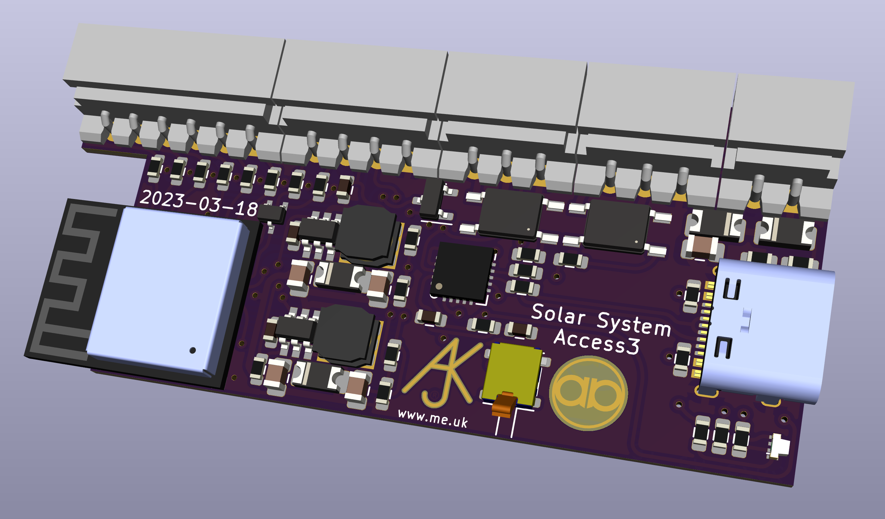

# SolarSystem

Modular access control and alarm system.

## Open source

Please bear in mind that this is an open source system with no warranty. The system can be used for access control, and/or alarm system, but you need to assess its suitability yourself, and consider any implications with regard to your insurers. The system **does not** come under any sort of approved alarm system scheme.

## Manuals

- [Overview](Manuals/Overview.md)
- [Server](Manuals/Server.md)
- [Configuration Tips](Manuals/ConfigTips.md)
- [Door and fobs](Manuals/DoorAndFob.md)

### Technical

- [API](Manuals/Tech-API.md)
- [Fob](Manuals/Tech-Fob.md)
- [Door](Manuals/Tech-Door.md)

### Hardware modules

- [Access controler](Manuals/Module-Access.md)
- [Bell box controller](Manuals/Module-Bellbox.md)
- [Keypad controlls](Manuals/Module-Keypad.md)

## ESP32 code for modules

Modules work as a mesh over WiFi, and one connects to a back end cloud management system. PCB designs are included (KiCad) as are 3D printable case designs.

Example of access control PCB:

## Back end management cloud system

Cloud back end for management of devices without the need for on-site controller. Runs on linux with mariadb and apache.

An instance of the cloud management system is run on [access.me.uk](https://access.me.uk/) by Andrews & Arnold Ltd, and provisioned DESFire cards can be ordered printed to your design.

Some assembled boards can be ordered from [A&A](https://www.aa.net.uk/etc/circuit-boards/)

Copyright © 2019-23 Adrian Kennard, Andrews & Arnold Ltd. See [LICENSE](LICENSE) file for details. GPL 3.0
